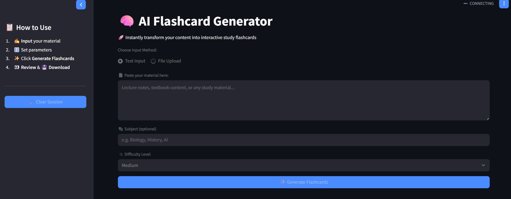

# 🧠 AI Flashcard Generator    
*Automatically convert study materials into interactive flashcards using Google Gemini AI*

## ✨ Features  
- **Multi-Input Support**: Process text directly or upload PDF/TXT files  
- **Smart Difficulty Levels**: Generate Easy/Medium/Hard questions  
- **Export Options**: Download flashcards as CSV or JSON  
- **PDF Processing**: Extract text from textbooks and lecture notes  
- **Responsive Web UI**: Built with Streamlit for seamless interaction  

## 🛠️ Installation  

### Requirements  
- Python 3.8+  
- Google Gemini API key ([Get API key](https://aistudio.google.com/))
- streamlit   

## Setup  

#### 1. Clone repository
```bash
git clone https://github.com/yourusername/flashcard-generator.git
cd flashcard-generator
```
#### 2. Create virtual environment
```bash
python -m venv venv
source venv/bin/activate  # Linux/Mac
.\venv\Scripts\activate   # Windows
```

#### 3. Install dependencies
```bash
pip install -r requirements.txt
```

#### 4. Configure API key
```bash
echo "GEMINI_API_KEY=your_api_key_here" > .env
```

## 🚀 Usage
 
#### 1. Start the application:
```bash
streamlit run main.py
```

#### 2. Input your content:
- Paste text directly
- Upload PDF or TXT files (≤10MB)

#### 3. Configure settings:
- Set subject (optional)
- Select difficulty level

#### 4. Generate & Export:
- Review AI-generated flashcards
- Download in CSV or JSON format

## 🏗️ Architecture
```bash
project/
├── utils/
│   ├── exporter.py           # CSV/JSON export handlers
│   ├── file_processor.py     # PDF/TXT text extraction
│   └── gemini_integration.py # Gemini API communication
├── flashcard_generator.py    # Core processing logic
├── main.py                   # Streamlit application
├── .gitignore
├── README.md
└── requirements.txt
```

## App Screenshot


## Sample input 
Computer vision is an interdisciplinary field that deals with how computers can be made to gain high-level understanding from digital images or videos. From the perspective of engineering, it seeks to automate tasks that the human visual system can do. "Computer vision is concerned with the automatic extraction, analysis, and understanding of useful information from a single image or a sequence of images. It involves the development of a theoretical and algorithmic basis to achieve automatic visual understanding. As a scientific discipline, computer vision is concerned with the theory behind artificial systems that extract information from images. The image data can take many forms, such as video sequences, views from multiple cameras, or multi-dimensional data from a medical scanner. As a technological discipline, computer vision seeks to apply its theories and models for the construction of computer vision systems. Machine vision refers to a systems engineering discipline, especially in the context of factory automation. In more recent times, the terms computer vision and machine vision have converged to a greater degree.

## Output
```yaml
[
  {
    "question": "What is computer vision?",
    "answer": "An interdisciplinary field that enables computers to understand digital images and videos.",
    "difficulty": "Easy"
  },
  {
    "question": "What does computer vision aim to automate?",
    "answer": "Tasks that the human visual system can perform.",
    "difficulty": "Easy"
  },
  {
    "question": "What is the main goal of computer vision?",
    "answer": "To extract, analyze, and understand information from images or videos.",
    "difficulty": "Easy"
  },
...
]
```
